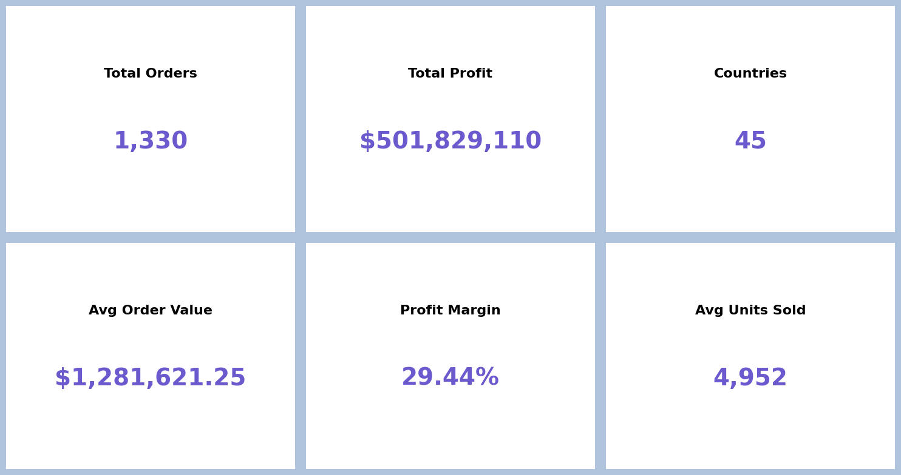
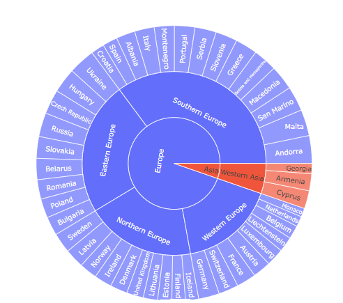
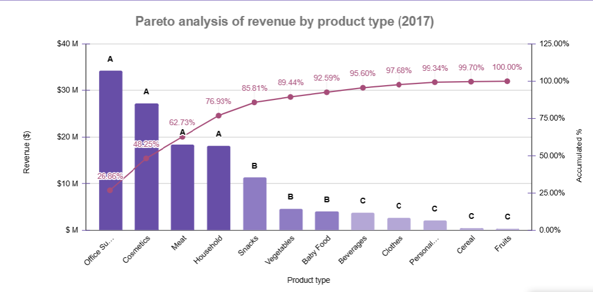
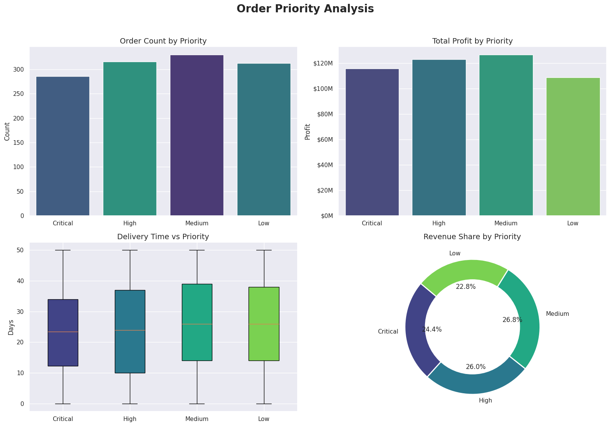
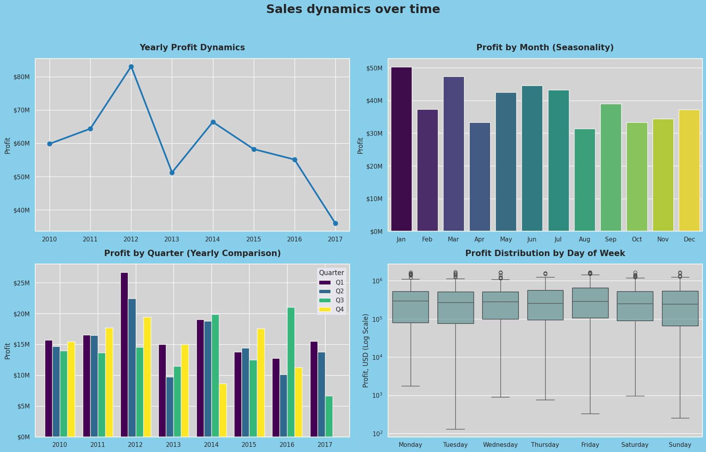

# Global Retail & E-commerce Performance Analysis

## 🎯 Project Overview
This project delivers a comprehensive end-to-end business analysis of a global retail dataset encompassing **1,248 orders across 45 countries**. Operating from the perspective of an internal Data Analyst, the objective was to look beyond raw numbers, evaluate regional sales performance, optimize corporate profit margins, and identify logistical bottlenecks to support long-term strategic decision-making.

---

## 🔗 Project Resources
* **Data Analysis & Dashboards:** [Google Sheets Spreadsheet](https://docs.google.com/spreadsheets/d/1btoatmm03iXYVBxqbBLuuqaxPbDBI-Cy2fXUHCLYxAc/edit?usp=sharing)
* **Data Transformation & Code:** [Google Colab Notebook](https://colab.research.google.com/drive/1PAc-bMBZKc2k84WvkD29N6_6uEfrlqbp?usp=sharing)

---

## 1. Executive Summary & North Star Metrics

A 60-second snapshot for executive leadership highlighting the operational scale, global reach, and overall financial health of the organization.

| 📦 Total Orders | 📈 Total Profit | 🌍 Countries | 💰 Avg Order Value | 📊 Profit Margin | 🧺 Avg Units Sold |
| :--- | :--- | :--- | :--- | :--- | :--- |
| **1,330** | **$501,829,110** | **45** | **$1,281,621.25** | **29.44%** | **4,952** |

 

<!-- 🖼️ MAIN KPI DASHBOARD DISPLAY -->

  
   
  <i>Figure 1: Executive KPI Dashboard – High-level financial and operational performance metrics.</i>

---

## 2. Profit Structure: Geographic Dominance of the European Market

### 🗺️ Headline: Europe generates 95% of global net profit, driven by Southern Europe and key micro-markets
While the company maintains a presence in 45 countries, profitability is heavily centralized. A deep dive into the geographical hierarchy reveals critical imbalances:
*   **The Powerhouse:** **Europe** is the undisputed anchor of our business, securing **~95%** of the total net profit. 
*   **Sub-Regional Leaders:** **Southern Europe** dominates regional performance with **$166.7M**, whereas **Western Asia** represents our most critical weak point, yielding only **$25.1M**.
*   **Top Performing Nations:** **Andorra, Ukraine, and Malta** emerge as the most profitable countries, demonstrating highly efficient sales models.

 

<!-- 🖼️ PLACEHOLDER: GEOGRAPHIC PROFIT STRUCTURE (Tree Map / Sunburst) -->

  
   
  <i>Figure 2: Hierarchical Profit Distribution – Europe's dominant market share and regional breakdown.</i>

---

## 3. Product Portfolio Analysis & Revenue Prioritization (ABC Analysis)

### 💄 Headline: Cosmetics anchor corporate margins, while Fruits yield near-zero profitability
An ABC analysis was conducted to segment products based on their revenue contribution and cross-referenced with actual profit margins to identify optimization areas:
*   **Category A (The Margin Driver):** **Cosmetics** consistently generate the highest net profit across all European sub-regions. Despite having a lower gross sales volume than Office Supplies, superior margin structures make it our most resilient asset.
*   **The Underperformer:** The **Fruits** category shows severe performance inefficiencies, pulling in **$4.9M in revenue but delivering a marginal $1.2M in profit**. 

 

<!-- 🖼️ PLACEHOLDER: ABC / PARETO ANALYSIS CHART -->

  
   
  <i>Figure 3: Analytical Rigor Matrix – Product revenue vs. profitability mapping for strategic portfolio decisions.</i>

---

## 4. Supply Chain & Logistics Efficiency (Lead Time)

### 📦 Headline: Delivery speed does not drive order value; Northern Europe leads in shipping velocity
We analyzed operational supply chain data to test the hypothesis that faster delivery times actively generate higher order values and profit:
*   **The Myth Busted:** A scatter plot analysis debits the assumption that delivery velocity correlates with profit. High-margin orders (exceeding **$1.5M**) occur uniformly across both immediate shipping windows (0–5 days) and long-tail timelines (45–50 days).
*   **Regional Transit Benchmarks:** Average global delivery time sits at 25 days. **Northern Europe** runs the most efficient operation with an average lead time of **23 days**, while **Eastern Europe** lags behind as the slowest sub-region at **27 days**.

 

<!-- 🖼️ PLACEHOLDER: LOGISTICS SCATTER / BOX PLOT -->

  
   
  <i>Figure 4: Supply Chain Analysis – Lead time distribution by region and correlation with profitability.</i>

---

## 5. Sales Dynamics & Historical Performance Trends

### 📉 Headline: Strategic peak in 2012 followed by long-term profit contraction and high January seasonality

A longitudinal timeline analysis highlights distinct historical phases and reliable annual demand spikes that challenge standard retail assumptions:
*   **The 2012 Peak & Volatility:** Corporate net profit reached its historical maximum in **2012 (exceeding $80M)**. However, 2013 marked a severe contraction down to ~$51M. Despite a temporary recovery in 2014, the business has faced a steady, multi-year decline in profitability leading into 2017.
*   **Subverted Seasonality:** Unlike typical retail models that rely on Q4 holiday surges, our data reveals that **January** is the most profitable month of the year (reaching $50M), closely followed by strong performance waves in **March, June, and July**. Meanwhile, autumn and late holiday quarters show lower capital efficiency.

 

<!-- 🖼️ AUTOMATIC PORTFOLIO DISPLAY -->

  
   
  <i>Figure 5: Advanced Time-Series Dashboard – Yearly macro trends, monthly seasonality distributions, and quarterly financial comparisons.</i>

---

## 🚀 Strategic Business Recommendations

1.  **Portfolio Restructuring (Fruits Category):** Address the low-margin "Fruits" line. The company should either re-negotiate procurement costs, radically optimize transport overhead for perishables, or reallocate storage space to higher-margin categories.
2.  **Scale Micro-Market Success Models:** Investigate the exact drivers behind the abnormally high profitability per unit in **Andorra and Malta**. Document local marketing and pricing strategies, and pilot them in larger, underperforming European countries.
3.  **Logistics Investment Redirection:** Since accelerated delivery speed does not yield a higher average transaction value, leadership should halt expensive "speed optimization" initiatives. Instead, focus supply chain capital on **reducing fixed transportation and freight overhead** to protect net margins.

---

## 🛠️ Technical Stack & Methodology

To ensure clean data hygiene and analytical accuracy, a decoupled processing approach was utilized:
*   **Data Processing & Transformation:** **Python (Pandas)** – Employed for advanced data cleaning, structural data type formatting, handling missing values, and mathematical formulations (such as cumulative percentages for Pareto tracking).
*   **Business Logic & Analysis:** **Google Sheets** – Used for data aggregation, executing ABC segmentation, and conducting core regional statistical benchmarks.
*   **Visual Analytics & Dashboarding:** **Google Sheets** – Designed a cohesive corporate dashboard and generated clean, minimalist stakeholder charts with removed grid-line clutter to focus strictly on data insights.
